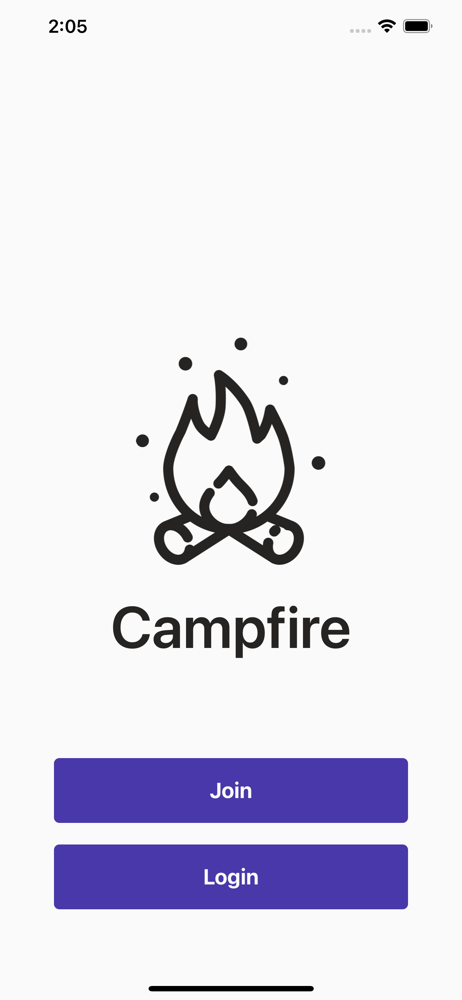
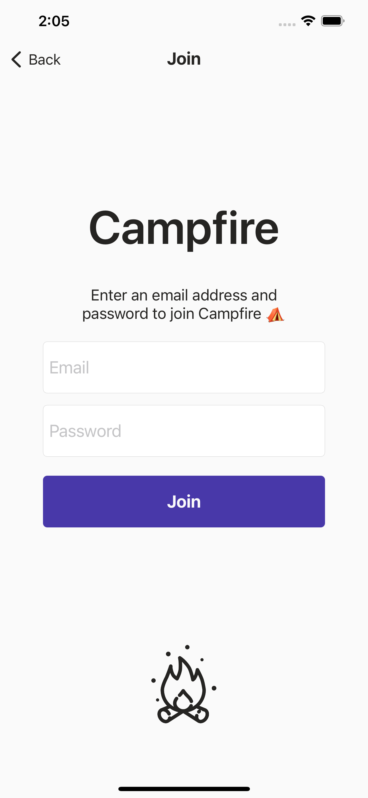
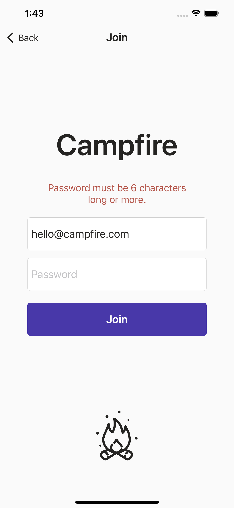
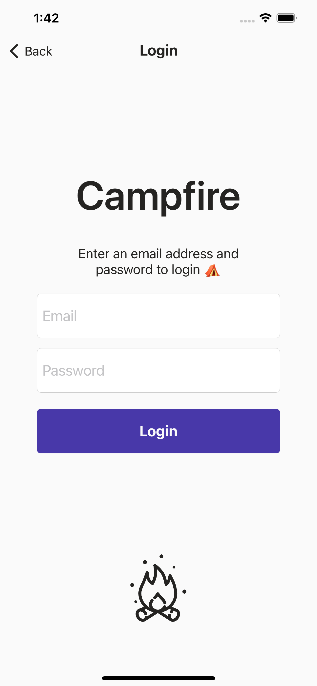
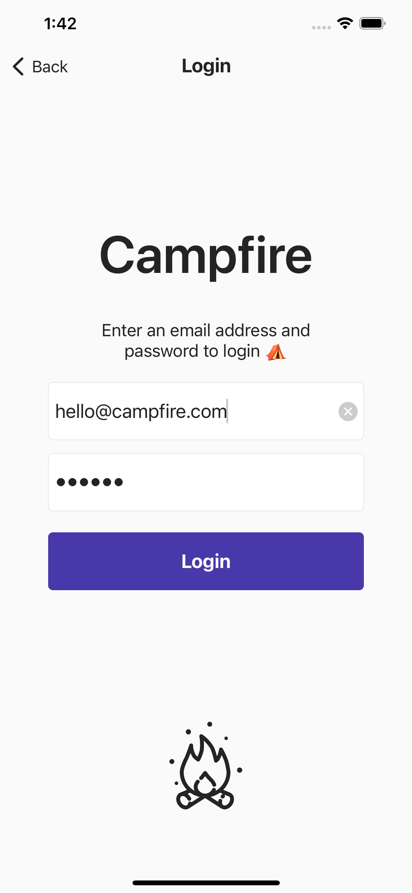
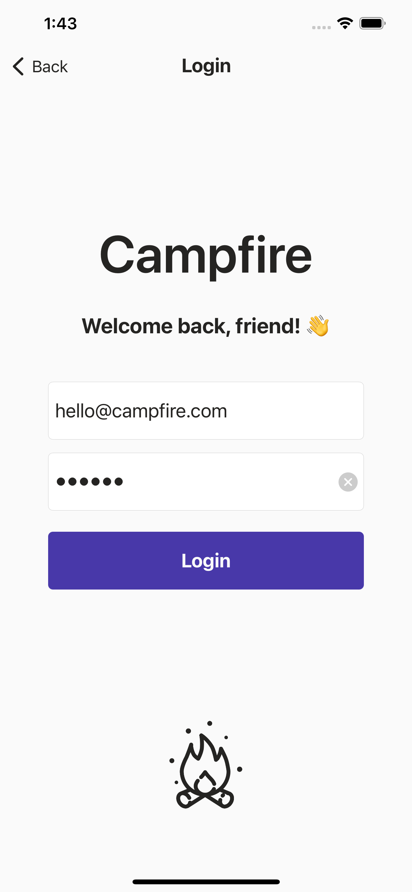

#  Campfire

### iOS chat app built with Firebase.

### **✨⛺️ To Run App :** 
- Run `pod install` inside project directory. (CocoaPods required)
- `open campfire.xcworkspace` in Terminal to open app in XCode.

 |
 |
 |
 |
 |
 |
